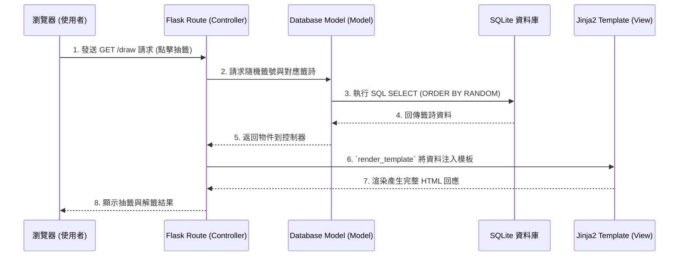

# 系統架構設計 - 線上算命系統

## 1. 技術架構說明

為了快速實現具備靈活互動以及持久資料儲存的產品，本專案將採用輕量且成熟的後端框架技術。我們沒有選擇複雜的前後端分離架構，而是利用伺服器渲染 (SSR) 將所有基礎建設整合在一起。

- **選用技術與原因**：
  - **後端框架 - Python + Flask**：輕量、好上手，對小型專案非常友善，能夠協助團隊快速建構抽籤與存檔 API 來應對簡單的商業邏輯。
  - **視圖層 - Jinja2**：Flask 內建支援的模板系統，可以直接在 HTML 裡寫迴圈與邏輯，加速 UI 開發。這對沒有專職前端工程師或追求快速上線的 MVP 非常合適。
  - **資料儲存 - SQLite**：內建於 Python 中無需額外佈署，由於線上算命的資料存取行為多為讀取 (如閱讀籤詩) 與單純紀錄新增，SQLite 足以負擔此類輕量需求。
  - **前端互動 - Vanilla JavaScript + CSS**：為了保留擲筊和抽籤時的「儀式感」，將以原生 JS 控制小型的介面切換與簡單動畫。

- **Flask MVC 模式說明**：
  - **Model (模型 - M)**：負責資料邏輯，包含與 SQLite 的連線與資料表映射，我們會將使用者資料、籤詩總表以及歷史紀錄在此定義。
  - **View (視圖 - V)**：負責最終頁面呈現。由 Jinja2 接手，把後端傳遞的變數 (如籤詩字句) 塞入已經建置好的 HTML 結構中並顯示給客戶端。
  - **Controller (控制器 - C)**：負責中介兩端。當使用者按下「求籤」時，Route 接收到 Request，透過 Model 從資料庫亂數撈出一支籤，接著將結果丟給 View 去繪製網頁。

## 2. 專案資料夾結構

```text
web_app_development/
├── app/                        # 應用程式主要資料夾
│   ├── __init__.py             # 初始化 Flask App 與載入設定
│   ├── models/                 # 資料庫模型 (Model)
│   │   ├── __init__.py
│   │   ├── user.py             # 會員模組
│   │   └── fortune.py          # 籤詩資料與歷史紀錄模組
│   ├── routes/                 # Flask 路由控制器 (Controller)
│   │   ├── __init__.py
│   │   ├── auth.py             # 處理註冊/登入
│   │   ├── fortune.py          # 處理擲筊/抽籤/解籤
│   │   └── donation.py         # 處理香油錢流程
│   ├── templates/              # Jinja2 HTML 模板 (View)
│   │   ├── base.html           # 全站共用基礎佈局 (Header/Footer)
│   │   ├── index.html          # 首頁與抽籤入口
│   │   ├── result.html         # 抽籤與擲筊結果頁面
│   │   ├── history.html        # 會員歷史紀錄頁面
│   │   └── login.html          # 會員登入/註冊頁面
│   └── static/                 # 前端靜態資源
│       ├── css/
│       │   └── style.css       # 樣式表
│       ├── js/
│       │   └── main.js         # 前端邏輯 (如觸發動畫)
│       └── images/             # 圖片素材 (神明、香爐、筊等)
├── instance/                   # 應用程式私密或產生之檔案夾
│   └── database.db             # SQLite 資料庫實體檔案
├── docs/                       # 專案文件存放區
│   ├── PRD.md                  # 需求規格
│   └── ARCHITECTURE.md         # 系統架構 (本檔案)
├── app.py                      # 系統進入點 (啟動腳本)
└── requirements.txt            # Python 套件版本相依清單
```

## 3. 元件關係圖

以下展示當使用者點擊「進行求籤」後，系統內部的資料與流程走向：



## 4. 關鍵設計決策

1. **模組化路由結構（Blueprints）**
   - **原因**：為了避免 `app.py` 積累過多程式碼，我們利用 Flask Blueprints 將應用切割為 `auth`（會員功能）、`fortune`（算命邏輯）、`donation`（香油錢）。這有助於後續程式碼的擴充和除錯。
2. **採用 Jinja2 作為 View 層而非前後端分離**
   - **原因**：前後端分離將會增加額外的協作與部署時間，對於這類注重即時上線驗證的專案，使用伺服器直接渲染頁面是效能與開發效率最平衡的選擇。也利於 SEO 如果未來籤文有對外公開的需求。
3. **資料庫內建籤詩內容庫**
   - **原因**：儘管籤詩可以寫在設定檔中，但將其統一放入 SQLite 以建立獨立表（如 `poems`）有利於後續「歷史紀錄表」與之關聯；若未來想要動態更新解籤內容也無需重啟或修改程式碼。
4. **前端 JS 分擔「儀式感展示」**
   - **原因**：系統真正的計算過程少於一秒，為了滿足抽籤時的「未知與期待感」，使用 Vanilla JS 攔截提交動作，做 1-2 秒的擲筊圖片轉動展示，再與後端進行資料互換顯示結果，低成本實現了優良的沉浸體驗。
