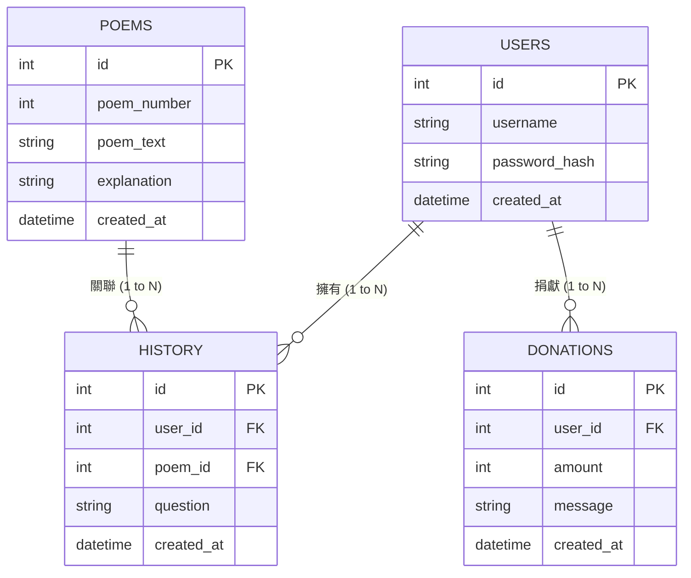

# 資料庫設計 - 線上算命系統

本文件根據產品需求與流程圖，定義系統的資料表結構 (Schema) 與實體關聯 (ER Diagram)。

## 1. ER 圖 (實體關係圖)

## 2. 資料表詳細說明

### `users` (會員資料表)
儲存註冊會員的帳號與密碼資訊。
- `id`: INTEGER PRIMARY KEY AUTOINCREMENT - 唯一識別碼
- `username`: TEXT NOT NULL - 登入帳號 (需唯一)
- `password_hash`: TEXT NOT NULL - 加密後的密碼
- `created_at`: DATETIME DEFAULT CURRENT_TIMESTAMP - 註冊時間

### `poems` (籤詩資料表)
存放系統預設的籤文內容與解籤說明。
- `id`: INTEGER PRIMARY KEY AUTOINCREMENT - 唯一識別碼
- `poem_number`: INTEGER NOT NULL - 籤號 (如 1, 2, 3...)
- `poem_text`: TEXT NOT NULL - 籤詩原文
- `explanation`: TEXT NOT NULL - 白話文解析
- `created_at`: DATETIME DEFAULT CURRENT_TIMESTAMP - 建立時間

### `history` (抽籤歷史紀錄)
紀錄會員每次抽籤求問的結果。
- `id`: INTEGER PRIMARY KEY AUTOINCREMENT - 唯一識別碼
- `user_id`: INTEGER NOT NULL - 關聯至 `users.id`
- `poem_id`: INTEGER NOT NULL - 關聯至 `poems.id`
- `question`: TEXT - 當時求問的事項
- `created_at`: DATETIME DEFAULT CURRENT_TIMESTAMP - 抽籤時間

### `donations` (香油錢捐獻紀錄)
紀錄會員的捐獻明細與祈福語。
- `id`: INTEGER PRIMARY KEY AUTOINCREMENT - 唯一識別碼
- `user_id`: INTEGER NOT NULL - 關聯至 `users.id`
- `amount`: INTEGER NOT NULL - 捐獻金額
- `message`: TEXT - 祈福語或還願內容
- `created_at`: DATETIME DEFAULT CURRENT_TIMESTAMP - 捐贈時間
