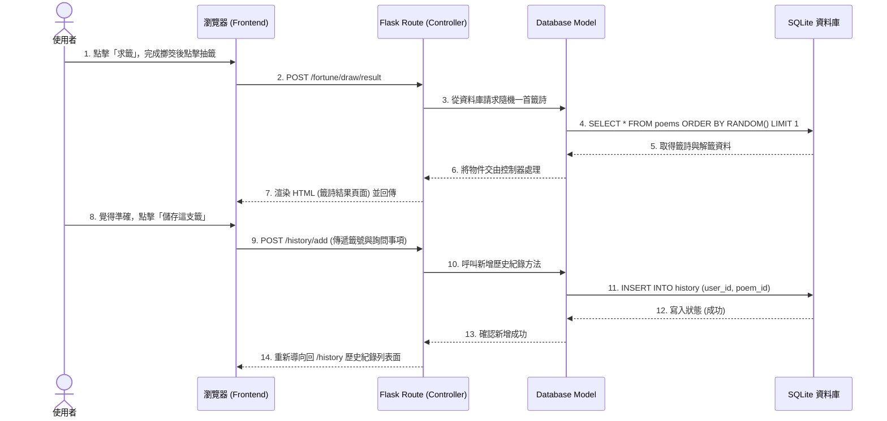

# 流程圖設計 - 線上算命系統

本文件根據 PRD 與系統架構文件所規劃之功能，透過視覺化圖表定出使用者的操作動線以及系統背後的資料互動流程，確保開發前邏輯結構完整。

## 1. 使用者流程圖（User Flow）

下圖展示了使用者進入網站後，主要的行為路徑，包含求籤流程、會員登入與捐贈香油錢の動線。

```mermaid
flowchart TD
    Start([進入網站首頁]) --> Auth{是否已登入？}
    Auth -->|否| GuestAction[訪客操作]
    Auth -->|是| UserAction[會員操作]

    GuestAction --> Login[會員註冊 / 登入頁面]
    Login --> UserAction

    GuestAction --> DrawProcess
    UserAction --> DrawProcess
    UserAction --> History[查看歷史紀錄]
    UserAction --> DonationProcess

    subgraph DrawProcess [求籤與占卜流程]
        direction TB
        A[點擊開始求籤] --> B[輸入求問事項 (如感情/事業)]
        B --> C[點擊擲筊]
        C --> D{是否聖筊？}
        D -->|否| E[未獲允許，重新擲筊]
        E --> C
        D -->|是| F[抽取籤詩]
        F --> G[顯示籤詩與詳細的白話解籤]
    end

    G --> Save{是否將結果存檔？}
    Save -->|是 (若未登入則導向登入)| SaveDB[將籤詩紀錄存入個人歷史庫中]
    Save -->|否| End([結束操作或重新首頁])
    SaveDB --> History

    subgraph DonationProcess [香油錢捐贈流程]
        direction TB
        donation[點選「添香油錢」選項] --> d_form[填寫捐贈金額與祈願語]
        d_form --> pay[進入模擬付款流程]
        pay --> donateDone[完成捐贈並顯示感謝畫面]
    end
```

## 2. 系統序列圖（Sequence Diagram）

下圖描述了最核心的功能：「使用者求籤並將結果儲存到資料庫」時，系統各元件（視圖、路由、資料庫）之間的流轉狀態。



## 3. 功能清單與 API 路由對照表

在接下來的實作中，我們會依照以下清單開發 Flask 的 Routing 與對應頁面。

| 功能區塊 | 操作內容 / 畫面 | HTTP 方法 | URL 路徑 | 預計的 Controller 函式 |
|---|---|---|---|---|
| **首頁** | 顯示歡迎畫面與說明 | `GET` | `/` | `index()` |
| **會員系統** | 顯示登入/註冊頁面 | `GET` | `/auth/login` | `auth.login_page()` |
| | 送出登入/註冊表單並驗證 | `POST` | `/auth/login` | `auth.login_action()` |
| | 會員登出 | `GET` | `/auth/logout` | `auth.logout()` |
| **線上抽籤** | 顯示求問表單與擲筊介面 | `GET` | `/fortune/draw` | `fortune.draw_page()` |
| | 確認求籤並隨機產生結果 | `POST` | `/fortune/draw/result` | `fortune.draw_result()` |
| **歷史紀錄** | 列出使用者的過往抽籤紀錄 | `GET` | `/history` | `fortune.history_list()` |
| | 新增一筆抽籤紀錄至資料庫 | `POST` | `/history/add` | `fortune.history_add()` |
| **香油錢** | 顯示香油錢捐贈表單 | `GET` | `/donation/donate` | `donation.donate_page()` |
| | 送出表單並處理捐獻紀錄 | `POST` | `/donation/donate` | `donation.donate_action()` |
